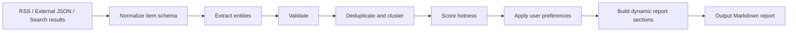

<div align="center">

# tradehot - Foreign Trade HOT Skill

**Turn foreign trade, cross-border e-commerce, platform policy, HS Code, market opportunity, and risk signals into actionable Chinese business briefings.**

<p>
  
  
  
  <a href="https://github.com/chnjames/tradehot-skill/actions/workflows/validate.yml"></a>
</p>

<p>
  <a href="README.md">中文</a>
  ·
  <a href="examples/">Examples</a>
  ·
  <a href="docs/hermes.md">Hermes Agent</a>
</p>

</div>

`tradehot` is a Codex Skill for Chinese-language foreign trade intelligence. It normalizes scattered information sources, extracts business entities, removes duplicates, ranks signals, and generates Markdown reports for operators, exporters, cross-border sellers, sourcing teams, and market development teams.

> [!IMPORTANT]
> This Skill does not replace legal, tax, customs, certification, or trade compliance advice. For tariffs, export controls, platform penalties, certification requirements, and other high-risk issues, verify with official sources and qualified professionals.

## What It Solves

Foreign trade signals are often scattered across news, platform announcements, official policies, customs updates, logistics sources, and market reports. `tradehot` turns those inputs into a stable structure and produces reusable business briefings.

| Scenario | Output |
| --- | --- |
| Daily trade monitoring | Foreign Trade HOT daily report |
| Platform policy tracking | Amazon / TikTok Shop / Shopee updates |
| Country and market research | Market brief |
| Category and HS Code analysis | Opportunity and risk brief |
| Risk monitoring | Tariff, sanctions, logistics, compliance, platform rule changes |
| Product research | Product opportunity radar |

## Quick Start

### Codex

Install from GitHub into your Codex user skill directory:

```powershell
git clone https://github.com/chnjames/tradehot-skill.git "$HOME\.codex\skills\tradehot"
```

Refresh or restart your Codex session, then trigger it in natural language:

```text
今天外贸 HOT
最近 TikTok Shop 有什么新规？
查一下 HS Code 9403 的出口机会
最近外贸风险有哪些？
给我做一份德国市场开发简报
```

### Hermes Agent

Recommended local install path:

```powershell
$src = "$env:TEMP\tradehot-skill"
if (Test-Path $src) { git -C $src pull } else { git clone https://github.com/chnjames/tradehot-skill.git $src }
New-Item -ItemType Directory -Force "$HOME\.hermes\skills\business\tradehot"
robocopy $src "$HOME\.hermes\skills\business\tradehot" /MIR /XD .git __pycache__ _cache /XF generated_* pipeline_* test_* *.pyc
```

If your Hermes build supports GitHub Skill installs, you can also try:

```powershell
hermes skills install chnjames/tradehot-skill
```

Run example:

```powershell
hermes chat --toolsets skills,terminal,web -q "/tradehot 今天外贸 HOT"
```

See [Hermes Agent Compatibility](docs/hermes.md) for details.

## Validate Locally

The project only uses the Python standard library. No third-party packages are required.

```powershell
cd scripts
python test_all.py
```

Expected result:

```text
ALL TESTS PASSED
```

## Generate a Report

By default, the pipeline reads enabled RSS/Atom sources from `sources/rss_sources.json`, then generates normalized item JSON and a Markdown report.

```powershell
cd scripts

python run_pipeline.py `
  --type daily `
  --config ..\sources\rss_sources.json `
  --items-output ..\examples\test_items.json `
  --report-output ..\examples\test_daily_report.md
```

Supported report types:

| Type | Purpose |
| --- | --- |
| `daily` | Daily foreign trade briefing |
| `weekly` | Weekly foreign trade briefing |
| `platform` | Platform update report |
| `market` | Country or market brief |
| `hs` | HS Code or category opportunity report |
| `risk` | Risk radar |
| `opportunity` | Product opportunity radar |

## Workflow



## Input Sources

### RSS / Atom

```powershell
python scripts\fetch_news.py `
  --mode rss-batch `
  --config sources\rss_sources.json `
  --output examples\rss_items.json
```

RSS sources are configured in:

```text
sources/rss_sources.json
```

### External JSON / Search Results

Normalize external items:

```powershell
python scripts\fetch_news.py --mode normalize --input examples\external_items_sample.json
```

Generate a report from external items:

```powershell
python scripts\generate_report.py `
  --type daily `
  --input examples\external_items_sample.json `
  --output examples\external_daily_report.md
```

## User Preferences

User preferences are configured in:

```text
sources/user_config.json
```

You can configure focus markets, platforms, categories, HS Codes, report windows, and high-risk alert preferences.

## Project Structure

```text
tradehot-skill/
├── SKILL.md
├── README.md
├── README.en.md
├── docs/
├── sources/
├── templates/
├── scripts/
└── examples/
```

## Limitations

- Real-time information must be verified with current sources.
- RSS feeds, search results, and external JSON are inputs only. Final reports should preserve source, timestamp, and confidence.
- Tariffs, certifications, sanctions, export controls, and tax matters should be checked against official documents or professional advice.
- This Skill is designed for intelligence organization, signal discovery, and business briefings. It should not be used to automate final compliance decisions.

## Roadmap

- Add more official source presets.
- Add more example reports and screenshots.
- Add more platform and market templates.
- Add optional connector presets for common intelligence workflows.
