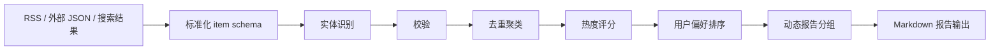

<div align="center">

# tradehot - 外贸 HOT Skill

**把外贸、跨境电商、平台政策、HS Code、市场机会与风险信号，整理成可执行的中文业务简报。**

<p>
  
  
  <a href="https://github.com/chnjames/tradehot-skill/actions/workflows/validate.yml"></a>
</p>

<p>
  <a href="README.en.md">English</a>
  ·
  <a href="examples/">Examples</a>
</p>

</div>

`tradehot` 是一个面向外贸、跨境电商、出口企业和市场开发人员的中文情报 Skill。它把分散的信息源标准化、去重、排序，并输出适合业务决策的 Markdown 简报。

> [!IMPORTANT]
> 本 Skill 不替代法律、税务、海关、认证或贸易合规专业意见。涉及关税、出口管制、平台处罚、认证要求等高风险事项时，请以官方文件和专业顾问意见为准。

## 它解决什么问题

外贸信息通常分散在新闻、平台公告、行业媒体、海关政策和市场报告里，手工整理容易漏掉来源、时间和风险信号。`tradehot` 的目标是把这些输入转成稳定结构，再生成可复用的业务简报。

适合用于：

| 场景 | 输出 |
| --- | --- |
| 今日外贸热点追踪 | 外贸 HOT 日报 |
| 平台政策监控 | Amazon / TikTok Shop / Shopee 等平台动态 |
| 国家市场研究 | 国家 / 区域市场简报 |
| 品类与 HS Code 分析 | 机会、风险、贸易信号 |
| 风险预警 | 关税、制裁、物流、合规、平台规则变化 |
| 选品研究 | 品类机会雷达 |

## 快速开始

从 GitHub 安装到 Codex 用户 Skill 目录：

```powershell
git clone https://github.com/chnjames/tradehot-skill.git "$HOME\.codex\skills\tradehot"
```

刷新或重启 Codex 会话后，可以用自然语言触发：

```text
今天外贸 HOT
最近 TikTok Shop 有什么新规？
查一下 HS Code 9403 的出口机会
最近外贸风险有哪些？
给我做一份德国市场开发简报
```

## 本地验证

本项目只依赖 Python 标准库，不需要安装第三方包。

```powershell
cd scripts
python test_all.py
```

期望结果：

```text
ALL TESTS PASSED
```

## 一键生成简报

默认读取 `sources/rss_sources.json` 中启用的 RSS/Atom 源，生成标准化 item JSON 和 Markdown 报告。

```powershell
cd scripts

python run_pipeline.py `
  --type daily `
  --config ..\sources\rss_sources.json `
  --items-output ..\examples\test_items.json `
  --report-output ..\examples\test_daily_report.md
```

支持的报告类型：

| 类型 | 用途 |
| --- | --- |
| `daily` | 今日外贸 HOT 日报 |
| `weekly` | 外贸周报 |
| `platform` | 平台动态 |
| `market` | 国家 / 市场简报 |
| `hs` | HS Code / 品类机会 |
| `risk` | 风险雷达 |
| `opportunity` | 选品机会 |

常用示例：

```powershell
python run_pipeline.py --type platform --platform "TikTok Shop"
python run_pipeline.py --type market --market EU
python run_pipeline.py --type hs --hs-code 9403
python run_pipeline.py --type risk
python run_pipeline.py --type opportunity
```

## 工作流



## 输入来源

### RSS / Atom

```powershell
python scripts\fetch_news.py `
  --mode rss-batch `
  --config sources\rss_sources.json `
  --output examples\rss_items.json
```

RSS 配置位于：

```text
sources/rss_sources.json
```

示例：

```json
{
  "sources": [
    {
      "id": "tradehot_sample",
      "name": "Tradehot Sample Feed",
      "url": "../examples/rss_feed_sample.xml",
      "source_tier": "industry_media",
      "enabled": true
    }
  ]
}
```

部署时把 `url` 换成真实 RSS/Atom URL 即可。

### 外部 JSON / 搜索结果

支持普通数组：

```json
[
  {
    "title": "Example",
    "summary": "Example summary",
    "url": "https://example.com",
    "source": "news",
    "published_date": "2026-06-16"
  }
]
```

也支持常见搜索结果结构：

```json
{
  "results": [
    {
      "name": "Search result title",
      "snippet": "Search result snippet",
      "link": "https://example.com"
    }
  ]
}
```

归一化：

```powershell
python scripts\fetch_news.py --mode normalize --input examples\external_items_sample.json
```

生成报告：

```powershell
python scripts\generate_report.py `
  --type daily `
  --input examples\external_items_sample.json `
  --output examples\external_daily_report.md
```

## 用户偏好

偏好配置位于：

```text
sources/user_config.json
```

可配置：

- 关注市场
- 关注平台
- 关注品类
- 关注 HS Code
- 默认报告窗口
- 高风险提醒偏好

## 项目结构

```text
tradehot-skill/
├── SKILL.md
├── README.md
├── sources/
│   ├── sources.zh.json
│   ├── sources.en.json
│   ├── platforms.json
│   ├── markets.json
│   ├── rss_sources.json
│   └── user_config.json
├── templates/
│   ├── daily_report.md
│   ├── platform_report.md
│   ├── market_report.md
│   ├── hs_code_report.md
│   ├── risk_report.md
│   └── product_opportunity.md
├── scripts/
│   ├── fetch_news.py
│   ├── source_connectors.py
│   ├── item_schema.py
│   ├── entity_extractor.py
│   ├── item_cluster.py
│   ├── report_sections.py
│   ├── rank_items.py
│   ├── generate_report.py
│   ├── run_pipeline.py
│   └── test_all.py
└── examples/
```

## 边界与限制

- 实时信息必须使用最新来源核实。
- RSS、搜索结果和外部 JSON 只是输入来源，最终报告仍应保留来源、时间和置信度。
- 对关税、认证、制裁、出口管制、税务等事项，应以官方文件或专业意见为准。
- 本 Skill 主要用于情报整理、线索发现和业务简报，不用于自动下结论或替代人工审核。

## Roadmap

- 增加更多官方来源预设。
- 增加英文 README。
- 增加示例报告截图或演示页面。
- 增加更多平台和市场维度的报告模板。
